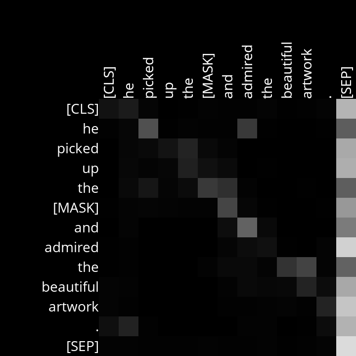

# Analysis

## Layer 4, Head 5

This head describes the contextual information derived from the relationship between delimiters, pronouns, prepositions and nouns. For example, in the first sentence the delimiter "the" is associated with the noun "aroma", which is the main noun and represents the sensory experience being described. In the second sentence,  "the" is associated with the noun "artwork". In the third sentence, the preposition "in" is associated with the noun "city" and the pronoun "his" with the noun "guitar". 

Example Sentences:
- She opened the [MASK] and enjoyed the aroma of fresh coffee.
- He picked up the [MASK] and admired the beautiful artwork.
- In the noisy city, he turned his old guitar and played a [MASK].

Here are the generated diagrams for the specific head: 

## Layer 5, Head 6

This head learned to identify the relationship between verbs and direct objects or action to an object. For example, in the first sentence, [MASK] which is an object seems to give a high attention score to "opened" which is the action. Similarly, in the second sentence, [MASK] gives a high score to "picked up", and in the third sentence, [MASK] scores "played" the highest.

Example Sentences:
- She opened the [MASK] and enjoyed the aroma of fresh coffee.
- He picked up the [MASK] and admired the beautiful artwork.
- In the noisy city, he turned his old guitar and played a [MASK].

## Layer 7, Head 2

This head learned to identify the relationship between the subject and the action if performs. For example, in the first sentence, "She" is performing the actions of "opened" and "enjoyed" and that is why we notice the highest attention scores for "She" in these 2 verbs. Similarly, in the second sentence, "He" performed the actions of "picked" and "admired", while in the third sentence, "he" performed the actions of "tuned" and "played".

Example Sentences:
- She opened the [MASK] and enjoyed the aroma of fresh coffee.
- He picked up the [MASK] and admired the beautiful artwork.
- In the noisy city, he turned his old guitar and played a [MASK].

